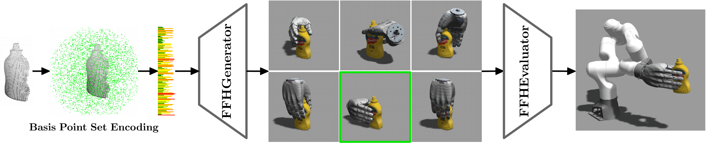
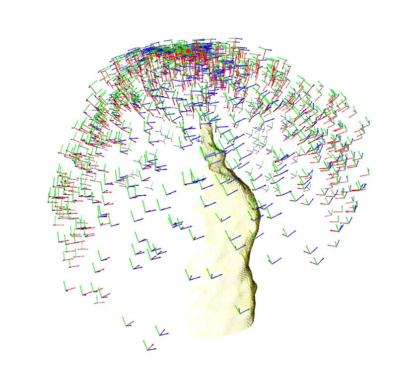
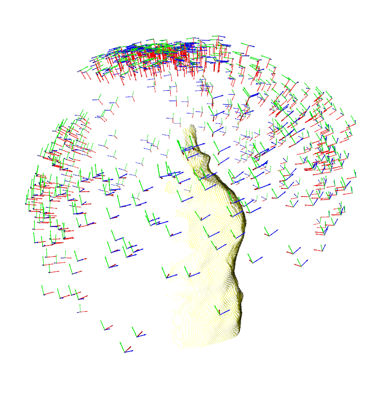
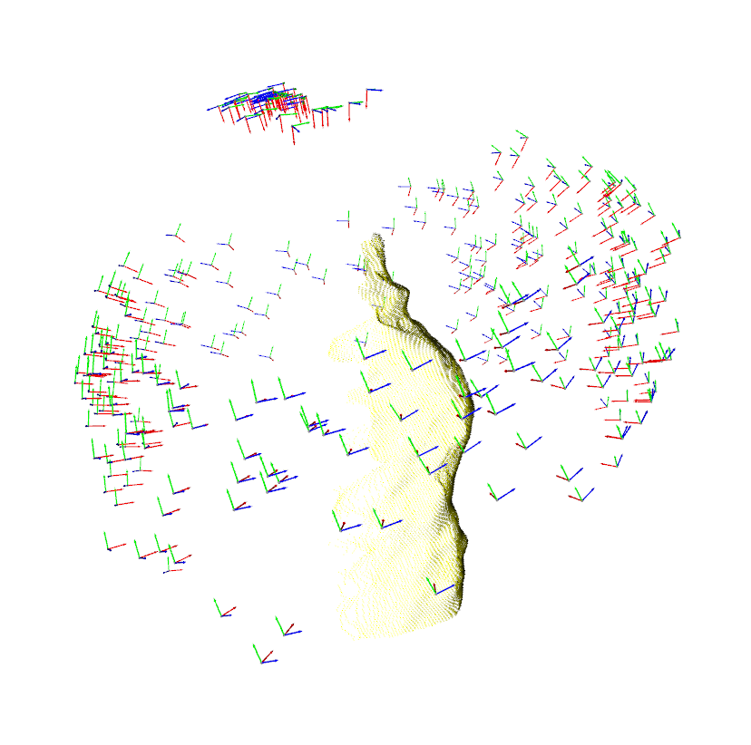
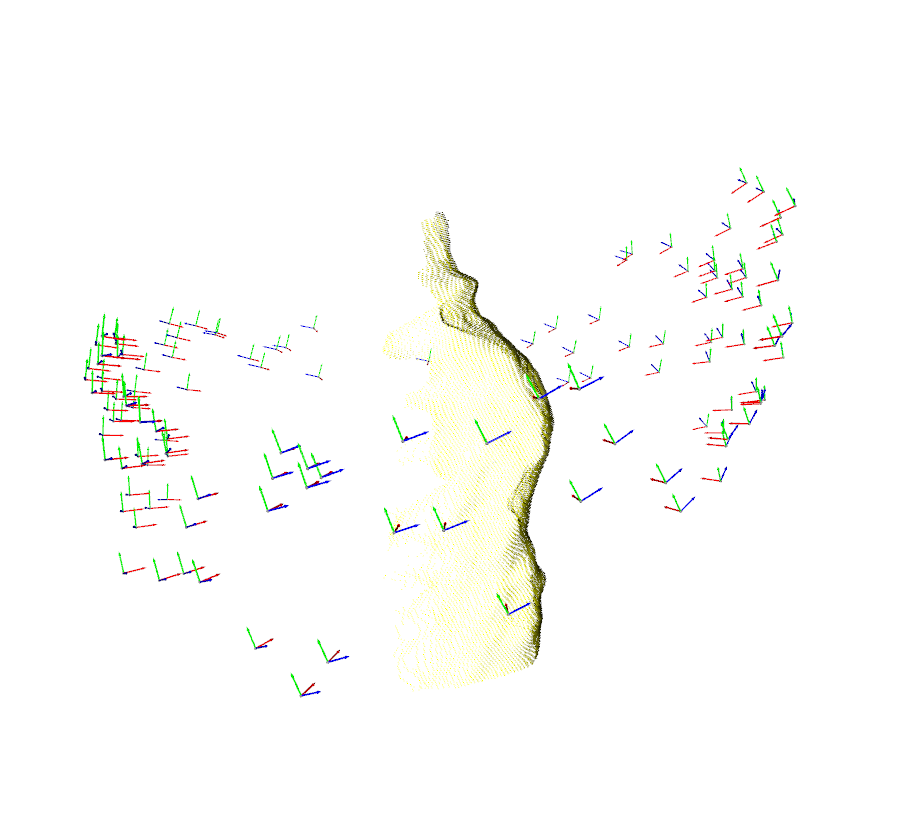
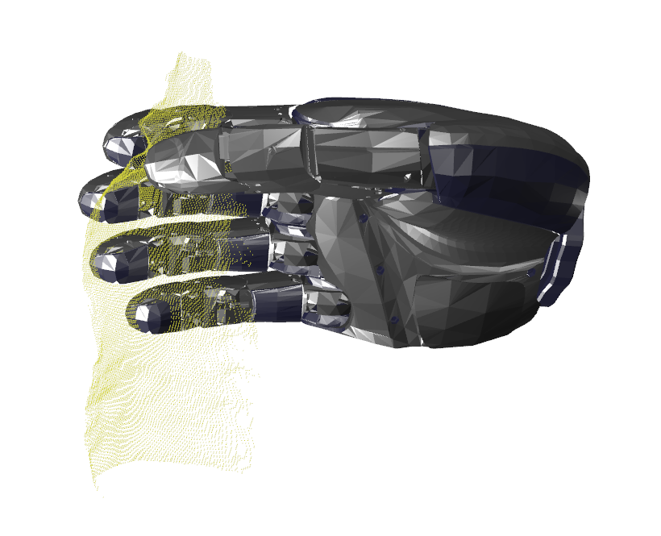

# FFHNet : Generating Multi-Fingered Robotic Grasps for Unknown Objects in Real-time

FFHNet (ICRA 2022 [Paper](https://ieeexplore.ieee.org/document/9811666)) is an ML model which can generate a wide variety of high-quality multi-fingered grasps for unseen objects from a single view.

Generating and evaluating grasps with FFHNet takes only 30ms on a commodity GPU. To the best of our knowledge, FFHNet is the first ML-based real-time system for multi-fingered grasping with the ability to perform grasp inference at 30 frames per second (FPS).

For training, we synthetically generate 180k grasp samples for 129 objects. We are able to achieve 91% grasping success for unknown objects in simulation and we demonstrate the model's capabilities of synthesizing high-quality grasps also for real unseen objects.



## Installation

Create a new conda environment with cudatoolkit 10.1

```
conda create -n myenv python==3.8
conda install -c anaconda cudatoolkit=10.1
```

Install all dependencies.

```
pip install -r requirements.txt
pip install git+https://github.com/otaheri/chamfer_distance
pip install git+https://github.com/otaheri/bps_torch
```

## Issues of LFS
Now there is some problem with LFS. If you have trouble clone the repo, please run
```
GIT_LFS_SKIP_SMUDGE=1 git clone repo_link
```

The model is located at here [link](https://drive.google.com/drive/folders/1T7JPnkggNxPqTVqxN1jcrrQGaKZYyAr3?usp=sharing).
After download, extract to repo root path.

## To run the evaluation script

```
python eval.py
```

| Data distribution from FFHGenerator  | Filter grasps with 0.5 thresh | Filter grasps with 0.75 thresh
| --------------------------------------- | --------------------------------------- |--------------------------------------- |
|        |  |  |

| Filter grasps with 0.9 thresh  | Best grasp |
| --------------------------------------- | --------------------------------------- |
|        |  |  |

## Citation

If you found FFHNet useful in your research, please consider citing:

```plain
@INPROCEEDINGS{2022ffhnet,
  author={Mayer, Vincent and Feng, Qian and Deng, Jun and Shi, Yunlei and Chen, Zhaopeng and Knoll, Alois},
  booktitle={2022 International Conference on Robotics and Automation (ICRA)},
  title={FFHNet: Generating Multi-Fingered Robotic Grasps for Unknown Objects in Real-time},
  year={2022},
  volume={},
  number={},
  pages={762-769},
  doi={10.1109/ICRA46639.2022.9811666}}
```

## Acknowledgement

[bps_torch](https://github.com/otaheri/bps_torch)
